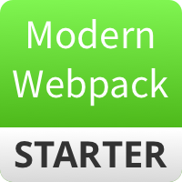

<p align="center"><a href="http://modern-webpack-starter.innermonkdesign.com/" target="_blank"></a></p>

<p align="center">
  <a href="http://opensource.org/licenses/MIT"></a>
  <a href="https://twitter.com/intent/tweet?url=https%3A%2F%2Fgithub.com%2Fjohndatserakis%2Fmodern-webpack-starter&text=Check%20out%20modern-webpack-starter%20on%20GitHub&via=johndatserakis">
  </a>
</p>

# modern-webpack-starter-vue
This is a version of [moden-webpack-starter](https://github.com/johndatserakis/modern-webpack-starter) that already has Vue installed. Good for when you want to use Vue but you can't use Vue-CLI for whatever reason. You can view the demo for the base version [here](http://modern-webpack-starter.innermonkdesign.com/).

### Features
- Vue
- Webpack 4.14.0
- Webpack-Dev-Server
- Bootstrap 4.1
- Babel
- SASS Handling
- Uglifying, Minimizing
- html-webpack-plugin, mini-css-extract-plugin, optimize-css-assets-webpack-plugin
- `@` Alias Support For Easy File Imports
- ESLint
- And more...

### Installing / Getting started

``` bash
# install dependencies
npm install

# serve using webpack-dev-server with hot reload at http://localhost:8080/
npm run watch

# build for production
npm run build
```

### Hit Me Up

Go ahead and fork the project! Message me here if you have questions or submit an issue if needed. I'll be making touch-ups as time goes on. Have fun with this!

### License

Copyright 2017 John Datserakis

[MIT](http://opensource.org/licenses/MIT)